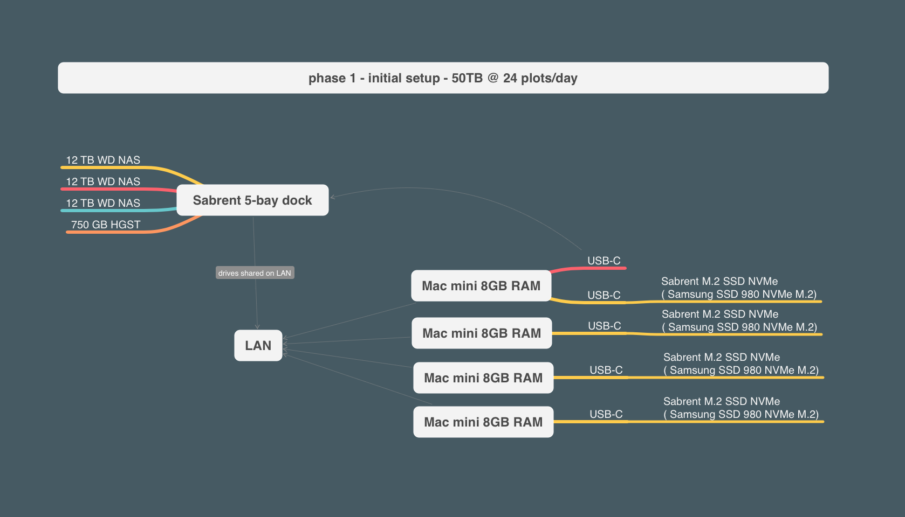
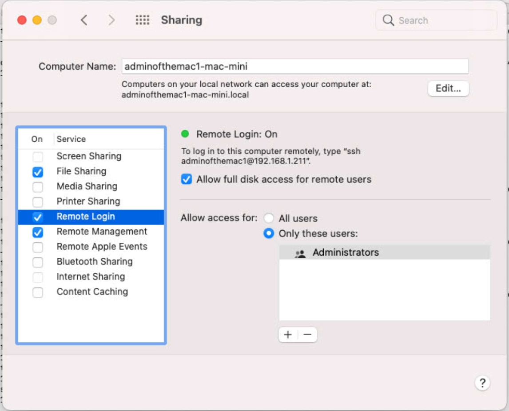
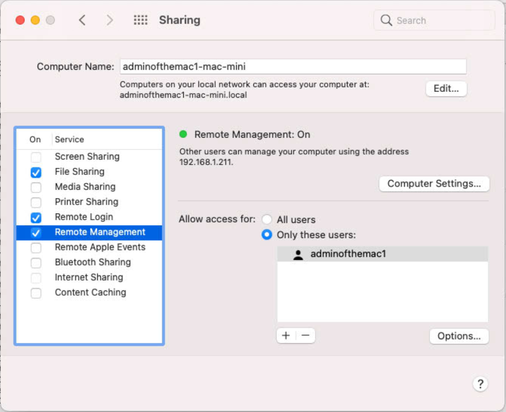
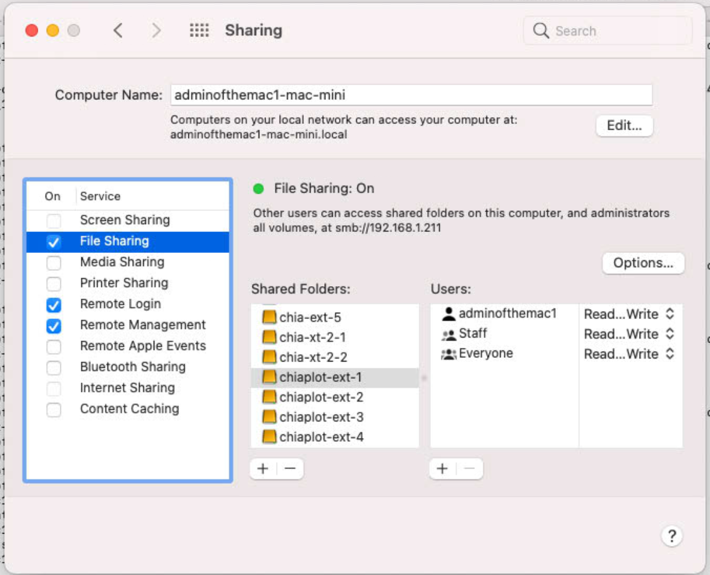

# Chia Network - Plotting Guide
A starting place for chia git installation and plotting on several Mac mini M1 8GB RAM 512GB SSD machines. One of the goals was to avoid homebrew and easy management through SSH. This includes all the scripts used to manage several Mac mini machines. Note, phase 1 isn't inteded to be optimal. It was meant to get started. Phase 3 is much more optimal/fast but will likely cost more.

### Overview - Phase 1

### Project Phases

#### Phase 1 - Beginners Guide to Chia Plotting
1. DONE - Phase 1 (Beginner's Guide) - a quick start and explanation of how to get setup plotting/farming Chia today. 
    * Goal: 50 TB and 24 plots/day.
    * Note: I do recommend buying the Mac mini M1 16GB ( even if it's only 1 or 2 ) this will double the plotting speed (covered in Phase 3)

#### Phase 2 - 100 TB+ storage
1. IN PROGERSS - Phase 2 (Increase Storage) - Share Phase 2 to grow your storage for long haul. 
    * Goal: 100 TB+ with SAS storage

#### Phase 3 - 36+ plots/day
1. COMING SOON - Phase 3 (Increase Plotting Speed) - Share Phase 3 to increase the plotting speed to 36 plots/day.
    1. Goal: 36+ plots/day ( 16-18 plots/day/mini )
    1. Equipment for each Mac mini M1 16GB RAM:
       1. 2x Thunderbolt 3 enclosure for NVMe M.2 SSD
       1. 2x NVMe M.2 SSD
       1. 2x USB-C enclosure for NVMe M.2 SSD ( or at least SSD )
       1. 2x NVMe M.2 SSD

### Sponsor / Support this project

This project took a lot of time and effort to create and to share with you. Consider sponsoring or supporting this project. This is not necessary but more a kind gesture.

* XCH Address: xch1w3c2nkkfh990qwvejlkj94f75cfy5fk2ecj3v2c7ja0xfxrzmgwst32tle
* ETH Address: 0x7f9F5Fd62E97B8Ed490B464CF710B45054720b92
* BTC Address: bc1q6k6tgj2nmyu44fwvut8hfh0dzht53a2nzaajve

### Hardware - Plotting 
1. 4x Mac mini M1 8GB RAM 512GB SSD
1. 4x Samsung (MZ-V8V1T0B/AM) 980 SSD 1TB NVMe
1. 4x Sabrent USB 3.2 Type-C NVMe enclosure

### Hardware - Storage
1. 1x Sabrent 5-bay dock/enclosure ( USB-C )
1. 4x 12TB WD NAS drives
1. 1x 750GB HGST NAS drive

### Limitations
1. Mac mini M1 
    1. 2x Thunderbolt 4 ( 40 Gbps )
    1. 2x USB-C 3.2 ( 10 Gbps )
    1. 1x LAN port ( either 1 Gpbs or 10 Gbps )
1. LAN - A 1 Gbps network is pretty slow for this type of setup. This limits transfers pretty heavilty from each Mac mini to the storage.
1. USB-C - Even if you have the 10 Gbps USB 3.2 that's still not as fast as what the Mac is capable of writing.
 * I highly recommend looking into a Thunderbolt 3 or better NVMe enclosures ( OWC makes one that's reasonable price )

### Setup Chia

#### Setup Hardware
1. Purchase hardware and assemble.

#### Setup macOS 
1. For this guide the macOS usernames for each plotting machine are: `adminofthemac1`, `adminofthemac2`, `adminofthemac3`, `adminofthemac4`
1. System Prefs > Engery Saver > prevent computer from sleeping
    * Sleeping prevents the plotter and farmer from working.
1. System Prefs > Engery Saver > start up after power failure
1. System Prefs > Sharing > Remote Login
    * Allows you SSH access for maintenance.
    * 
1. System Prefs > Sharing > Remote Management
    * Allows you to start plotters and fix unmounted drives ( happens occasionally )
    * 
1. System Prefs > Sharing > File Sharing
    * Add your Sabrent 5-bay enclosure drives onto the network
    * 

#### Setup Chia from Git
Note: steps that require the macOS Keychain Access need to be done from the macOS UI (in Terminal) not SSH. 

1. Install Xcode dev tools: 
    1. `xcode-select —install`
    1. Alternatively, download the `Command_Line_Tools_for_Xcode_12.5.dmg` yourself once and send to each mac and then install.
1. Install python
    1. `curl https://pyenv.run | bash`
    1. `export pyenv export PATH="/Users/adminofthemac1/.pyenv/bin:$PATH" eval "$(pyenv init -)" eval "$(pyenv virtualenv-init -)"`
    1. `exec $SHELL`
    1. `pyenv update`
    1. `pyenv install 3.9.4`
    1. `pyenv global 3.9.4`
1. Setup Rust + Cargo (package manager) - only if you are not using Homebrew ( this is a requirement in chia 1.1.5+ )
    1. `curl --proto '=https' --tlsv1.2 -sSf https://sh.rustup.rs | sh`
    1. `source $HOME/.cargo/env`
    1. `exec $SHELL`
    1. `rustup --version`
1. Setup Chia from git
    1. `pushd ~/Documents/`
    1. `git clone https://github.com/Chia-Network/chia-blockchain.git -b latest`
    1. `cd chia-blockchain`
    1. `sh install.sh`
    1. `. ./activate`
    1. `chia init`
1. Enable Keychain Access - must be done in macOS UI (in Terminal) for Keychain Access UI password prompt
    1. Repeat above steps on the machine EXCEPT `sh install.sh`
    1. `chia keys add`
    1. Enter the mnemonic ( assumes you created one in a Chia GUI already )
1. Start a farmer+node on one machine
    1. `chia start all`
1. Add your harddrives to the farmer
    1. `chia plots add -d /Volumes/chiaplot-ext-1`
    1. `chia plots add -d /Volumes/chiaplot-ext-2`
    1. `chia plots add -d /Volumes/chiaplot-ext-3`
    1. `chia plots add -d /Volumes/chiaplot-ext-4`
    1. `chia plots add -d /Volumes/chiaplot-ext-5`
1. Done

#### First plot
Note for some reason I can't get plotting to run (macOS Keychain Access errors) from SSH. The plot start must be done from macOS UI in Terminal.

1. Add our own chia log dir for performance scripts to use
    1. `mkdir -p ~/.chia/logs`
1. Plot a single plot to verify everything is working:
    1. `screen -d -m -S chia1 bash -c 'pushd ~/Documents/chia-blockchain/ && . ./activate && sleep 0 && chia plots create -k32 -n1 -t/Volumes/chia-temp -2-t/Volumes/chia-temp -d/Volumes/chiaplot-ext-1 -b7000 -u128 -r6 -a########## | tee ~/.chia/logs/chia1_1_.log'`
    * This assumes your are writing to your mounted external drive
    * Uses 7GB of RAM ( leave 1GB for macOS to avoid swapping to the hard drive )
    * Uses 6 cores/threads ( M1 chip has 8 cores - 4 performance cores and 4 low energy cores ). AFAIK: Chia will mostly use 1 core and sometimes the others.
1. Wait about 4 hours. See below for scripts to check on progress.

#### Subsequent plotting
Once you got a plot on each machine it'll be time to optimize and test various settings. That part is left up to you. Here's a setting that gets 6-8 plots/day if no farmer/node is running on the machine:

1. Concurrent plotting 6-8 plots/day using 3400MB RAM and 4 cores/threads each (will plot 40 plots). You can repeat these settings on each workstation and replacing the final destination drive from `chiaplot-ext-1` to whatever you have it named/mounted:
    1. `screen -d -m -S chia1 bash -c 'pushd ~/Documents/chia-blockchain/ && . ./activate && sleep 0 && chia plots create -k32 -n40 -t/Volumes/chia-temp -2-t/Volumes/chia-temp -d/Volumes/chiaplot-ext-1 -b3400 -u128 -r4 -a########## | tee ~/.chia/logs/chia1_1_.log'`
    1. `screen -d -m -S chia2 bash -c 'pushd ~/Documents/chia-blockchain/ && . ./activate && sleep 3600 && chia plots create -k32 -n40 -t/Volumes/chia-temp -2-t/Volumes/chia-temp -d/Volumes/chiaplot-ext-1 -b3400 -u128 -r4 -a########## | tee ~/.chia/logs/chia2_1_.log'`
1. Check progress for each plotter (press `CTRL+a` then `d` to exit `screen`):
    1. `screen -x chia1`
    1. `screen -x chia2`

#### Progress scripts
1. How do I see how far along are the plots in percentages % ?
    1. Download this and place in `~/Documents/` on your plotters: [chia-plot-progress.sh](scripts/chia-plot-progress.sh)
    1. `date; ~/Documents/chia-plot-progress.sh ~/.chia/logs/*`

#### Performance scripts
1. How long are my plots taking? 
    1. Total time: `cat ~/.chia/logs/chia1_1_.log | grep "Total time"; echo --------------------------------------------------; cat ~/.chia/logs/chia2_1_.log | grep "Total time";`
    1. Copy time: `cat ~/.chia/logs/chia1_1_.log | grep "Copy time"; echo --------------------------------------------------; cat ~/.chia/logs/chia2_1_.log | grep "Copy time";`
    1. Averages of plotting: `grep -i "total time" ~/.chia/logs/*.log |awk '{sum=sum+$4} {avg=sum/NR} {tday=86400/avg*8*101.366/1024} END {printf "%d K32 plots, avg %0.1f seconds, %0.2f TiB/day \n", NR, avg, tday}'`
    1. Average of copying: `grep -i "Copy time" ~/.chia/logs/*.log |awk '{sum=sum+$4} {avg=sum/NR} {tday=86400/avg*8*101.366/1024} END {printf "%d K32 plots, avg %0.1f seconds, %0.2f TiB/day \n", NR, avg, tday}'`

#### Maintenance scripts
1. I got disconnected from SSH, copy/paste isn't working, what do I do?
    1. `reset`
    1. `ssh adminofthemac1@192.168.X.XXX`
    1. `pushd ~/Documents/chia-blockchain/; . ./activate;`
    1. `chia farm summary`
1. Is the plotter working correctly? 
    1. `tail ~/.chia/logs/chia1_1_.log ~/.chia/logs/chia2_1_.log`
1. Are there any errors / warnings that I should pay attention to?
    1. `grep ~/.chia/mainnet/log/debug.log -e harvester
1. I have an extra SSD plugged into a Mac to store final plots. How can I move all the files from SSD to the mounted drive with SSH?
    1. `SCREEN -d -m -S transporter bash -c 'rsync -aP --remove-source-files /Volumes/SAMSUNG_T5/ /Volumes/chiaplot-ext-1/'
    1. `screen -ls`
   1. `screen -x transporter` (press `CTRL+a` then `d` to exit `screen`)